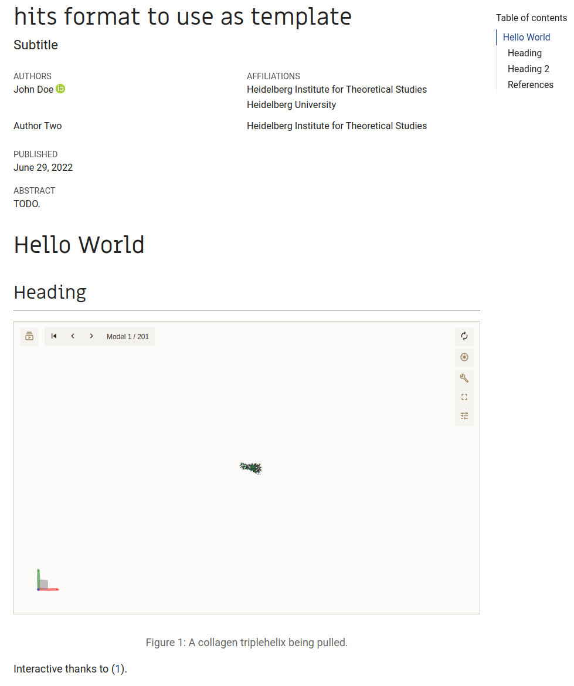
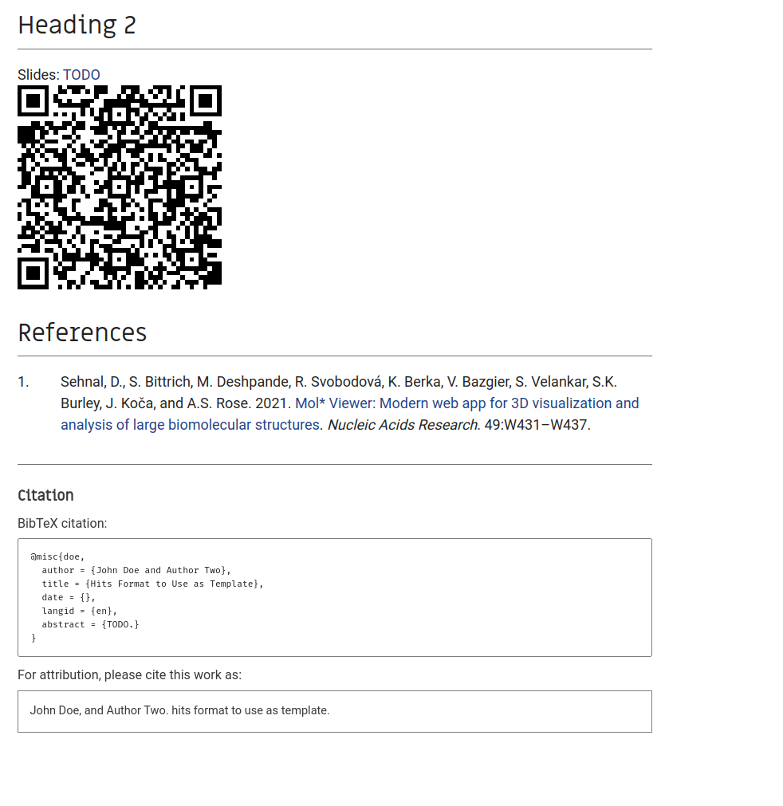

# HITS Styles for quarto

## Usage

Download the extensions and its template `.qmd` using

````bash
quarto use template hits-mbm-dev/hits-quarto
````

Install the extension format only using 

````bash
quarto install extension hits-mbm-dev/hits-quarto
````

Then use one of the formats (or multiple):

```yaml
format:
  hits/main-html: default
  hits/main-docx: default
  hits/main-revealjs: default
  hits/main-pdf:
    keep-tex: true  
  hits/poster-html:
      qrcode:
        text: "https://github.com/hits-mbm-dev/hits-quarto"
        size: "250"
```

Note: the poster format uses the `poster.qmd` template, while `index.qmd` is an example for the main formats.
Because it is named `index`, it automatically works with GitHub pages.

Looking to submit to a journal? Use one of these formats: <https://github.com/quarto-journals>

## Screenshots





